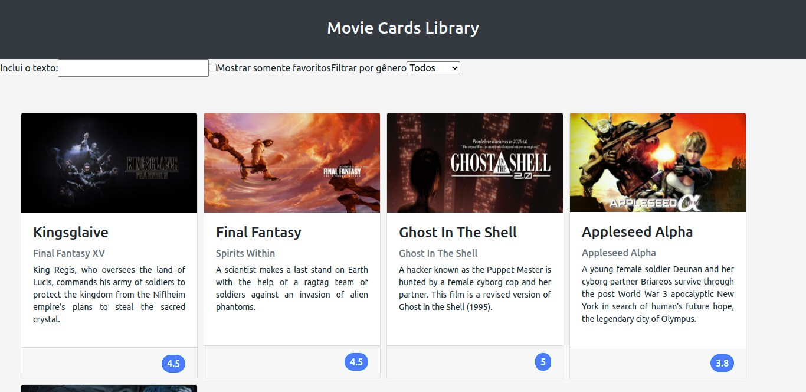

<h1 align="center">
  
</h1>

<h3 align="center">
  Curso realizado na Trybe - Edu Souza o/
</h3>

<blockquote align="center">“Enquanto acreditarmos em nossos sonhos, nunca nos faltarão forças para lutarmos por eles.”</blockquote>

<h4 align="center">
  Repositório - Movie cards library stateful
</h4>

 

  &nbsp;
  &nbsp;
  

  <a href="#rocket-Sobre-o-projeto">Sobre o projeto</a>&nbsp; &nbsp; |&nbsp; &nbsp;
  <a href="#postbox-Entrega"">Entrega</a>&nbsp; &nbsp; |&nbsp; &nbsp;
  <a href="#unlock-Licença">Licença</a>

## :rocket: Sobre o projeto

#### Movie cards library stateful

Você vai criar uma pequena biblioteca dinâmica com cartões informativos sobre filmes.
Você deverá implementar um pequeno conjunto de componentes, alguns possuindo estado a ser gerenciado, e combiná-los para criar uma biblioteca de cartões dinâmica.

#### Screenshots:

   &nbsp;

## :postbox: Entrega

#### :clipboard: Requisitos

- 
<a href="#1"> :pushpin: 1.</a> Crie um componente chamado `SearchBar`.

- 
<a href="#2"> :pushpin: 2.</a> Renderize um formulário dentro de `SearchBar`.

- 
<a href="#3"> :pushpin: 3.</a> Renderize um input do tipo texto dentro do formulário em `SearchBar`.

- 
<a href="#4"> :pushpin: 4.</a> Renderize um input do tipo checkbox dentro do formulário em `SearchBar`.

- 
<a href="#5"> :pushpin: 5.</a> Renderize um select dentro do formulário em `SearchBar`.

- 
<a href="#6"> :pushpin: 6.</a> Crie um componente chamado `AddMovie`.

- 
<a href="#7"> :pushpin: 7.</a> Configure o estado inicial do componente `AddMovie`.

- 
<a href="#8"> :pushpin: 8.</a> Renderize um formulário dentro de `AddMovie`.

- 
<a href="#9"> :pushpin: 9.</a> Renderize um input do tipo texto dentro do formulário em `AddMovie` para obter o título do novo filme.

- 
<a href="#10"> :pushpin: 10.</a> Renderize um input do tipo texto dentro do formulário em `AddMovie` para obter o subtítulo do novo filme.

- 
<a href="#11"> :pushpin: 11.</a> Renderize um input do tipo texto dentro do formulário em `AddMovie` para obter o caminho da imagem do novo filme.

- 
<a href="#12"> :pushpin: 12.</a> Renderize uma `textarea` dentro do formulário em `AddMovie` para obter a sinopse do novo filme.

- 
<a href="#13"> :pushpin: 13.</a> Renderize um `input` do tipo `number` dentro do formulário em `AddMovie` para obter a avaliação do novo filme.

- 
<a href="#14"> :pushpin: 14.</a> Renderize um `select` do formulário em `AddMovie` para selecionar o gênero do novo filme.

- 
<a href="#15"> :pushpin: 15.</a> Renderize um botão do formulário em `AddMovie` para fazer uso dos dados do novo filme, contidos no estado de `AddMovie`.

- 
<a href="#16"> :pushpin: 16.</a> Crie um componente chamado `MovieLibrary`.

- 
<a href="#17"> :pushpin: 17.</a> Configure o estado inicial do componente `MovieLibray`.

- 
<a href="#18"> :pushpin: 18.</a> Renderize `SearchBar` dentro de `MovieLibrary`.

- 
<a href="#19"> :pushpin: 19.</a> Renderize `MovieList` dentro de `MovieLibrary`.

- 
<a href="#20"> :pushpin: 20.</a> Renderize `AddMovie` dentro de `MovieLibrary`.

- 
<a href="#21"> :pushpin: 21.</a> Adicione proptypes a todos os componentes.

### Concluído :rocket:

Acesse o deploy do projeto [aqui](https://edusouza-programmer.github.io/Trybe_Projeto_11-3_Edu_Souza/).

#
## :unlock: Licença

Este projeto está licenciado sob a Licença MIT - consulte [LICENSE](https://opensource.org/licenses/MIT) para maiores detalhes.
